<p align="center">
  <a href="https://raw.githubusercontent.com/viditshah5656/viditshah5656/main/intro.mp4">
    
  </a>
</p>

<p align="center">
  <a href="https://raw.githubusercontent.com/viditshah5656/viditshah5656/main/intro.mp4">
    <b>▶ WATCH INTRO · 10 SECONDS</b>
  </a>
</p>

<div align="center">
  <a href="https://checkmyprofolio.github.io/"></a>
  <a href="https://linkedin.com/in/viditshah5656"></a>
  <a href="https://github.com/viditshah5656/Infera"></a>
  <a href="https://orcid.org/0009-0009-0658-6157"></a>
</div>

<br>

<h1 align="center">Hi, I'm Vidit Shah 👋</h1>

<p align="center">
  <b>Robotics & Automation Engineer · AI / ML · Computer Vision · Local AI · Systems Engineering</b>
</p>

<p align="center">
I build intelligent systems by connecting <b>perception → intelligence → planning → action</b> across robotics, AI, software, and automation.
</p>

> **I’m strongest when a problem crosses boundaries:** when a model has to become a product, when software has to understand hardware, or when multiple technical layers need to work together as one system.

---

## 🧭 What I’m strongest at

| Area | What that means in practice | Technologies / concepts |
|---|---|---|
| 🤖 **Robotics & Automation** | Connecting sensing, decision logic, planning and physical action into a complete loop. | Robotics · Control Systems · PLC · Microcontrollers · Sensors · Automation |
| 🧠 **AI / ML / LLMs** | Building model-driven applications, prediction pipelines, agents and local inference systems. | Python · PyTorch · TensorFlow · Keras · LLMs · RAG · Agents · LoRA / QLoRA |
| 👁️ **Computer Vision** | Turning images and video into information that a larger system can reason about and act on. | OpenCV · Detection · Image Processing · Vision Pipelines |
| ⚙️ **Local AI Infrastructure** | Running models close to the machine, routing requests and designing around real hardware limits. | llama.cpp · GGUF · CUDA · Model Routing · Streaming · Hardware-aware inference |
| 🌐 **Software Architecture** | Designing the path from frontend → API → backend → model → storage so the system stays usable and debuggable. | FastAPI · React · Next.js · Electron · Vite · SQLite · TypeScript |
| 🔌 **API & Systems Integration** | Connecting different models, runtimes and services behind coherent developer-facing interfaces. | REST · OpenAI-compatible APIs · Anthropic Messages · SSE · HTTP |
| 🧪 **Rapid Prototyping** | Moving from experiment → working prototype → tested system → polished product. | Git · Linux · Docker · Testing · Benchmarking |

---

## 🧠 How I approach engineering

```text
PERCEIVE  →  UNDERSTAND  →  PLAN  →  BUILD  →  TEST  →  SHIP
   ↓             ↓            ↓         ↓         ↓        ↓
signals       models       logic     system    failure   usable
vision        algorithms   rules     APIs      analysis  product
sensors       inference    tools     UI        metrics   docs
```

I naturally think in **systems rather than isolated components**. A camera, model, API, database and interface are more useful when they form a reliable chain than when each piece is impressive on its own.

---

## 🌌 My engineering strengths

<table width="100%">
<tr>
<td width="33%" valign="top">
<b>Systems thinking</b><br/>
I break complex problems into interacting components, interfaces and feedback loops.
</td>
<td width="33%" valign="top">
<b>Hardware awareness</b><br/>
I think about VRAM, latency, compute limits, thermal constraints and the machine underneath the software.
</td>
<td width="33%" valign="top">
<b>End-to-end ownership</b><br/>
I’m comfortable moving between models, backend services, APIs, interfaces and deployment.
</td>
</tr>
<tr>
<td valign="top"><b>Debugging mindset</b><br/>I trace failures through the stack instead of patching only the visible symptom.</td>
<td valign="top"><b>Integration mindset</b><br/>I enjoy connecting technologies that normally live in separate layers.</td>
<td valign="top"><b>Product translation</b><br/>I try to turn technically difficult systems into something people can actually understand and use.</td>
</tr>
<tr>
<td valign="top"><b>Performance awareness</b><br/>I balance quality, memory, latency, reliability and hardware constraints rather than optimizing one metric blindly.</td>
<td valign="top"><b>Experimentation</b><br/>I’m comfortable testing unfamiliar models, architectures and tools against real constraints.</td>
<td valign="top"><b>Learning velocity</b><br/>I learn the technology needed to solve the problem instead of forcing every problem into one familiar stack.</td>
</tr>
</table>

---

## 🎨 Skills at a glance

<p align="center">
  
</p>

<p align="center">
  
  
  
  
  
  
</p>

### Languages

<p>
  
  
  
  
  
  
  
</p>

### AI / ML

<p>
  
  
  
  
  
  
  
  
</p>

### Robotics / Vision / Edge

<p>
  
  
  
  
  
  
  
  
  
</p>

### Software / Infrastructure

<p>
  
  
  
  
  
  
  
  
  
</p>

---

## 🧩 Selected projects

| Project | What it demonstrates | Link / status |
|---|---|---|
| **Infera** | Local-first AI gateway that routes multiple model backends through familiar API contracts and a local browser workspace. | [Repository](https://github.com/viditshah5656/Infera) · [Live site](https://viditshah5656.github.io/Infera/) |
| **MeeraAI** | Local desktop AI assistant with model orchestration, RAG, speech, tools and hardware-aware inference. | 🔒 Private R&D |
| **AarnaAI** | AI-assisted market analysis experiment using LSTM, Random Forest and technical indicators in an interactive interface. | 🔒 Private R&D |
| **Autonomous AI Portfolio** | Portfolio experience using local browser inference to make AI part of the interface itself. | [Live](https://checkmyprofolio.github.io/) |
| **Binance Futures Testnet CLI** | API engineering around signed requests, validation, error handling and deterministic request construction. | [Repository](https://github.com/viditshah5656/binance-futures-trading-bot) |

### What each project says about me

**Infera** → API architecture, model routing, local infrastructure, streaming and developer experience.

**MeeraAI** → local AI orchestration, voice systems, RAG, tools, hardware-aware inference and desktop application architecture.

**AarnaAI** → ML experimentation, data pipelines, time-series modelling and turning quantitative ideas into usable interfaces.

**Autonomous AI Portfolio** → frontend engineering, browser inference, WebGPU and making an AI system part of the product itself.

**Binance Futures Testnet CLI** → practical API integration, cryptographic request signing, validation and failure-boundary thinking.

---

## 🔧 The kind of problems I like solving

<table width="100%">
<tr><td><b>How do I run useful AI locally?</b></td><td>Model choice, quantization, VRAM limits, runtimes, context, tools and latency.</td></tr>
<tr><td><b>How do I connect different AI backends?</b></td><td>Routing, adapters, normalized interfaces, compatibility layers and streaming.</td></tr>
<tr><td><b>How do I turn perception into action?</b></td><td>Vision / sensor input → inference → planning → control / automation.</td></tr>
<tr><td><b>How do I make complex systems understandable?</b></td><td>Good APIs, clean UI, observability, documentation and sensible architecture.</td></tr>
<tr><td><b>How do I make an experiment become a product?</b></td><td>Prototype → benchmark → debug → package → document → ship.</td></tr>
</table>

---

## 📚 Current engineering interests

`Local AI` · `AI Agents` · `LLM Infrastructure` · `RAG` · `Model Routing` · `Computer Vision` · `Robotics` · `Autonomous Systems` · `Voice AI` · `Edge Inference` · `Human-AI Interfaces` · `Hardware-Aware AI`

---

## 🔗 Find my work

<p align="center">
  <a href="https://checkmyprofolio.github.io/"><b>🌐 Portfolio</b></a>
  &nbsp; · &nbsp;
  <a href="https://linkedin.com/in/viditshah5656"><b>LinkedIn</b></a>
  &nbsp; · &nbsp;
  <a href="https://github.com/viditshah5656/Infera"><b>⚡ Infera</b></a>
  &nbsp; · &nbsp;
  <a href="https://github.com/viditshah5656/binance-futures-trading-bot"><b>🔐 Binance Testnet CLI</b></a>
  &nbsp; · &nbsp;
  <a href="https://orcid.org/0009-0009-0658-6157"><b>🔬 ORCID</b></a>
</p>

---

## ⚡ In one sentence

> **I build intelligent systems that connect perception, AI, software and automation — with a strong preference for local control, practical architecture and technology people can actually use.**

<p align="center">
  <b>Robotics · AI · Vision · Local Inference · Systems Engineering</b>
</p>
